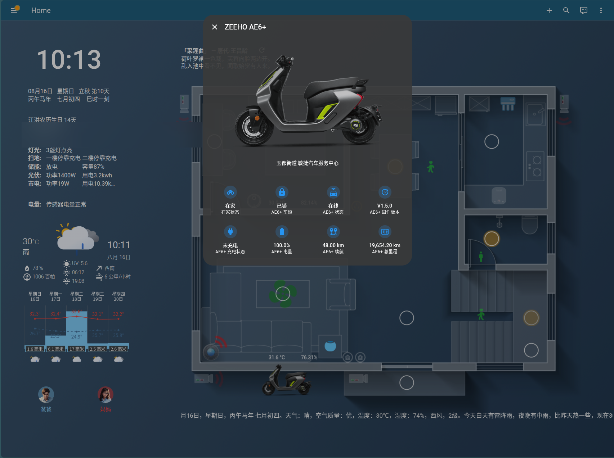
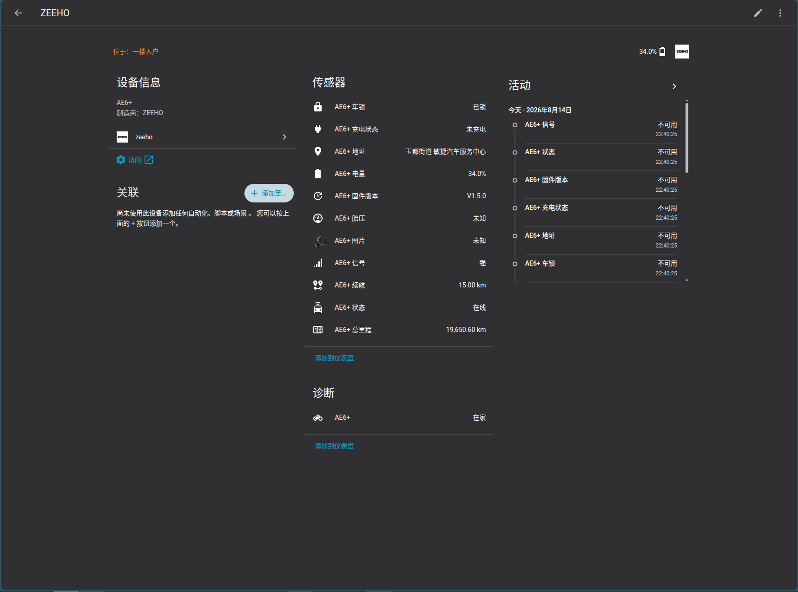
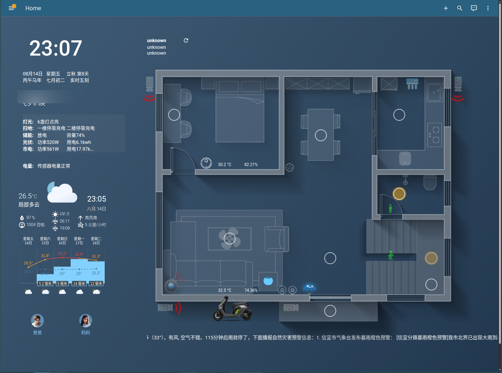

# ZEEHO EV（极核）Home Assistant 集成

非官方的 **极核（ZEEHO）电动车** Home Assistant 自定义集成，通过极核 App 的官方接口获取车辆数据。

> 本集成与 GitHub 上的 [zhoujunn/zeeho](https://github.com/zhoujunn/zeeho) 是**相互独立**的：本集成使用 **手机号 + 短信验证码登录**（无需手动填 Token / VIN），且提供更丰富的车辆数据与地址反地理编码（显示小区/街道名）。



## ✨ 功能特性

- 🔑 **手机号 + 短信验证码登录**，自动发现车辆（无需手动填 Token 和 VIN）
- 📊 车辆实时数据：总里程、剩余电量、续航里程、充电状态、OTA 状态等
- 📍 车辆定位：地图追踪（device_tracker）+ 实时地址（街道/小区级，基于 OpenStreetMap）
- 🖼️ 车辆图片实体（可直接用于卡片展示）
- 🔐 登录令牌自动管理：令牌约 10 天过期，集成会提前提醒，在「选项」里输入验证码即可 30 秒续期

## 📸 截图

| 集成实体 | 配置图标 |
| --- | --- |
|  |  |

## 📦 安装

### 方式一：HACS（推荐）

1. HACS → 集成 → 右上角菜单 → **自定义存储库**
2. 添加：`https://github.com/MX10085/zeeho-ev-homeassistant`，类别选择 **集成（Integration）**
3. 安装后重启 Home Assistant

### 方式二：手动安装

1. 下载最新 [Release](https://github.com/MX10085/zeeho-ev-homeassistant/releases) 中的 `zeeho_ev.zip`
2. 解压后将 `custom_components/zeeho_ev` 文件夹复制到 Home Assistant 的 `config/custom_components/` 目录
3. 重启 Home Assistant

## 🚀 使用方法

### 1. 添加集成

1. 进入 **设置 → 设备与服务 → 添加集成**
2. 搜索并选择 **ZEEHO EV（极核）**
3. 输入**极核 App 绑定的手机号**，点击下一步
4. 手机收到短信验证码后，输入验证码并提交
5. 集成会自动登录并发现你账号下的共享车辆，添加完成

> ⚠️ **重要：建议用「小号」登录，不要用你手机 App 的主账号！**
>
> 极核官方 App 是**单会话模式**——同一个账号在同一时间只能在一台设备上登录。集成登录后，你手机上的极核 App 会被挤下线，反之亦然（集成也会因此失效）。
>
> **推荐做法**：
> 1. 用另一个手机号注册一个极核 App 小号（无需购车）
> 2. 在主账号的极核 App 里，把车辆**授权共享**给小号
> 3. 集成用**小号手机号**登录，手机 App 用主号，互不干扰

### 2. 查看实体

添加成功后会自动创建以下实体（`zeeho_ev_*`）：

| 实体 | 说明 |
| --- | --- |
| `sensor.zeeho_ev_*_mileage` | 总里程（km） |
| `sensor.zeeho_ev_*_battery` | 剩余电量（%） |
| `sensor.zeeho_ev_*_range` | 预估续航（km） |
| `sensor.zeeho_ev_*_lock` | 车辆锁状态 |
| `sensor.zeeho_ev_*_charge` | 充电状态 |
| `sensor.zeeho_ev_*_ota` | OTA 升级状态 |
| `sensor.zeeho_ev_*_status` | 车辆状态 |
| `sensor.zeeho_ev_*_signal` | 信号强度 |
| `sensor.zeeho_ev_*_address` | 实时地址（小区/街道名） |
| `sensor.zeeho_ev_*_pressure` | 胎压（部分车型无此功能，可忽略） |
| `device_tracker.zeeho_ev_*_tracker` | 地图定位 |
| `image.zeeho_ev_*_image` | 车辆图片 |

### 3. 令牌续期（重要）

极核服务器的登录令牌约 **10 天** 过期，无法自动续期（官方 App 内部机制不对外提供）。本集成会：

- **提前 2 天**推送提醒"登录即将过期"
- 过期后卡片显示不可用并再次提醒

**续期方法**：进入 **设置 → 设备与服务 → ZEEHO EV → 选项**，输入手机号（与集成登录时**同一个**，即小号）→ 下一步（自动发送验证码）→ 输入验证码 → 完成。全程约 30 秒，无需删除集成。

### 4. 卡片展示示例

车辆图片实体可直接用于 picture / button 卡片：

```yaml
type: picture
image: /local/zeeho/ae6_car.png
```

或将 `image.zeeho_ev_*_image` 实体用于媒体卡片显示车辆照片。

## 🙏 致谢

本项目基于 [zhoujunn/zeeho](https://github.com/zhoujunn/zeeho) 的集成框架开发，感谢原作者的开源分享。

与之相比，本项目的主要改进与区别：
- **手机号 + 短信验证码登录**（原版需手动填写 Token / VIN）
- **自动发现车辆**，无需手动配置
- **地址反地理编码**（GCJ-02 坐标转换 + OpenStreetMap，显示小区/街道名）
- 更多车辆数据实体（总里程、续航、OTA、信号等）
- 登录令牌自动续期提醒

## ⚠️ 免责声明

- 本项目**非官方**，与极核（ZEEHO）/ 春风动力（CFMOTO）无任何关联
- 登录接口的签名算法与凭据**逆向自官方 App**，仅供个人学习与自用，请勿滥用
- 接口可能随时变更，导致集成失效，恕不另行通知
- 使用本集成产生的一切后果由使用者自行承担

## 📄 许可证

[GPL-2.0](LICENSE)
